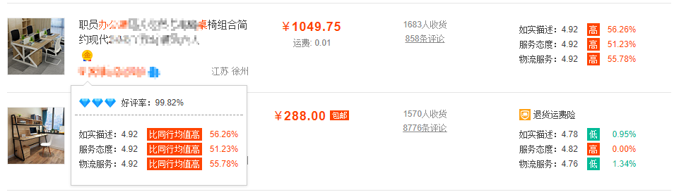
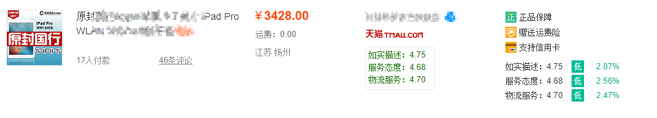

# Tampermonkey script repository
存放[Tampermonkey]((http://tampermonkey.net/))脚本

## 淘宝搜索PLUS
1. 淘宝搜索页面自动加载店铺评分，无需鼠标悬停查看！快速查看店铺评分以及同行对比！
2. 搜索页面自定义排序方式与显示方式。

[GreasyFork安装地址](https://greasyfork.org/zh-CN/scripts/32140-淘宝搜索plus)

[./taobao-search-plus](./taobao-search-plus)

## Pixiv搜索结果排序 | Pixiv search sort
1. 搜索结果按收藏数从大到小排序
2. 适配[TS] Pixiv++ V3：分页加载后自动排序
3. 适配[TS] Pixiv++ V3：在右上角的按钮组添加排序按钮(最下面一只)，对所有已加载图像进行排序

[GreasyFork安装地址](https://greasyfork.org/zh-CN/scripts/32008-pixiv搜索结果排序-pixiv-search-sort)

[./pixiv-search-sort](./pixiv-search-sort)
## Licence:
Released under the [MIT](https://opensource.org/licenses/MIT) License.